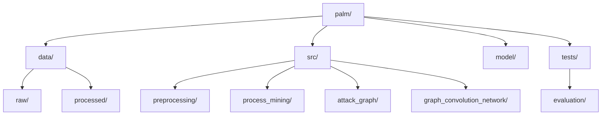

# PALM

## Overview

PALM is an innovative framework that bridges the gap between event log analysis and threat modeling in e-commerce systems. By leveraging process mining techniques and graph convolutional networks, PALM transforms often-overlooked event log data into predictive insights for enhanced security analysis.

## Features

- Event log processing and analysis
- Process model discovery using Inductive Miner algorithm
- Attack graph generation incorporating domain knowledge
- Novel exploit prediction using Graph Convolutional Networks (GCN)


## Flow Chart


## Installation

1. Clone the repository:
git clone https://github.com/mrcodeScholar/palm.git
cd palm
Copy

## Usage

1. Preprocess the raw event log data,

2. Discover the process model,

3. Generate the attack graph,

4. Train and evaluate the GNN models,

## Results

Our model achieves the following performance on the test set:

- Accuracy: 83.33%
- Precision: 83.33%
- Recall: 88.24%
- F1 Score: 85.71%
- AUC-ROC: 0.9186

## Contributions

1. **Fork the repository**: Click the "Fork" button at the top right of this repository to create a copy of the repository in your GitHub account.

2. **Clone your fork**: Clone your forked repository to your local machine using:
   ```bash
   git clone https://github.com/your-username/PALM.git
   ```

3. **Create a branch**: Create a new branch for your contribution. Use a descriptive name for your branch.
   ```bash
   git checkout -b your-branch-name
   ```

4. **Make your changes**: Make the necessary changes to the codebase. Ensure your code follows the project's coding guidelines and conventions.

5. **Commit your changes**: Commit your changes with a clear and descriptive commit message.
   ```bash
   git commit -m "Description of your changes"
   ```

6. **Push to your fork**: Push your changes to your forked repository.
   ```bash
   git push origin your-branch-name
   ```

7. **Create a pull request**: Go to the original repository and click the "New Pull Request" button. Provide a clear and detailed description of your changes and the problem they solve or the feature they add.

## Contact

For any queries, please open an issue or contact [Swapnil Pandey](mailto:2023proj051@goa.bits-pilani.ac.in).
