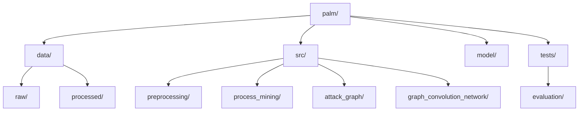

# PALM: Process-Aware Link Prediction Model for E-Commerce Security

## Overview

PALM (Process-Aware Link Prediction Model) is an innovative framework that bridges the gap between large-scale event log analysis and threat modeling in e-commerce systems. By leveraging process mining techniques and graph convolutional networks, PALM transforms often-overlooked event log data into predictive insights for enhanced security analysis.

## Features

- Event log processing and analysis
- Process model discovery using Inductive Miner algorithm
- Attack graph generation incorporating domain knowledge
- Novel exploit prediction using Graph Convolutional Networks (GCN)

## Flow Chart

## Installation

1. Clone the repository:
git clone https://github.com/mrcodeScholar/palm.git
cd palm
Copy

## Usage

1. Preprocess the raw event log data:

2. Discover the process model:

3. Generate the attack graph:

4. Train and evaluate the GCN model:

## Results

Our model achieves the following performance on the test set:

- Accuracy: 83.33%
- Precision: 83.33%
- Recall: 88.24%
- F1 Score: 85.71%
- AUC-ROC: 0.9186

## Contributing

We welcome contributions to PALM!

## Contact

For any queries, please open an issue or contact [Swapnil Pandey](mailto:2023proj051@goa.bits-pilani.ac.in).
